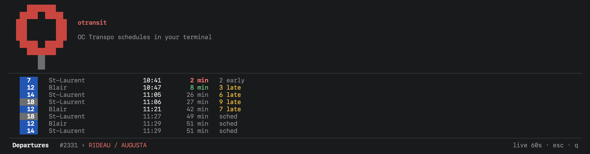
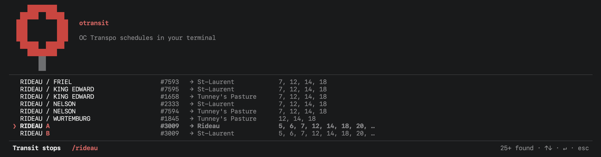
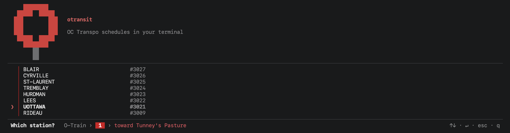

# otransit

[](https://github.com/sina-negarandeh/otransit/actions/workflows/ci.yml)

Live OC Transpo departures in the terminal.



The colour is the interface. How long you have is red under two minutes, amber
under six, green under fifteen, and dim past that, so the board answers "do I
need to leave now" before you have read a single number.

```
     14    St-Laurent                13:31       6 min   on time
     7     St-Laurent                13:44      18 min   7 late
     12    Blair                     13:46      21 min   12 late
     7     St-Laurent                13:48      23 min   sched
     14    St-Laurent                13:51      26 min   4 late
     18    St-Laurent                13:58      33 min   9 late
     7     St-Laurent                14:00      35 min   sched
──────────────────────────────────────────────────────────────────────
 Departures   #2331 › RIDEAU / AUGUSTA             live 26s · esc · q
```

The times are when each bus will actually arrive, not when it was timetabled:
the 12 is due at 13:34 and running twelve minutes late, so it lands after a 7
that was scheduled after it. Rows marked `sched` are beyond the range of the
live feed.

## Why

I noticed that the last thing I usually do before closing my laptop is check
for transit updates to see if I should leave or squeeze in a few more minutes
of work. This always breaks my flow, forcing me to either open maps on my
laptop or pick up my phone. Since I've been living in the terminal lately, I
thought this would be a great opportunity to solve that pain point while
improving my skills in Rust, TUIs, and GTFS. Also, this was fun!

## Install

```bash
git clone https://github.com/sina-negarandeh/otransit && cd otransit
cargo run --release -- update
```

`update` downloads the published GTFS feed, which is 109 MB and needs no key. It
unpacks the feed and builds a SQLite cache. This takes about ten seconds.

```
checking https://oct-gtfs-emasagcnfmcgeham.z01.azurefd.net/public-access/GTFSExport.zip
  downloaded 109 MB
  extracting...
  routes 314
  stops 5859
  trips 156133
  stop_times 6318222
  building indexes...
schedule updated (109 MB)
```

Run it when the browser tells you to. OC Transpo republishes on its own
schedule, not on a fixed cadence. A realtime trip ID is only guaranteed to match
the export it was issued against. So the browser asks the server at startup, and
it tells you only when a newer export exists. The question costs one round trip
and no body. An unchanged feed costs the same:

```
checking https://oct-gtfs-emasagcnfmcgeham.z01.azurefd.net/public-access/GTFSExport.zip
schedule already current (304 Not Modified)
```

The new cache is built next to the live one and swapped at the end, so a failed
download cannot leave you without a schedule.

### Live times

Scheduled times work with no setup. Live predictions need a free subscription
key from the [developer portal](https://nextrip-public-api.developer.azure-api.net/).

```bash
cp .env.example .env    # then paste your key in
```

## Use

```bash
cargo run --release
```

Browse, if you know the route:

```
 ❯ Bus                               71 routes running today
   O-Train                           3 lines · scheduled times only
──────────────────────────────────────────────────────────────────────
 What are you taking?                type to find a stop · ↑↓ · ↵ · q
```

Or type a pole number, a stop name, or several words in any order. `bank
somerset` finds `BANK / SOMERSET W`.



Two pairs there share a name and their routes, and the destination column is
the only thing separating them. The last two share something worse: pole number
`#3009` covers both, because `stop_code` is not unique in this feed. What tells
them apart is the platform letter, in red beside the name.

Either path ends at a list of stops in travel order. The rule down the left is
the route's own colour, so the O-Train's lines carry theirs:



Keys: `↑↓`/`jk` move, `↵` select, `esc` back, `/` search from anywhere, `p`
pin the board you are looking at, `q` quit.

Pinned stops sit above `Bus` and `O-Train` on the first screen, so the stop you
check every day is already under the cursor when the app opens:

```
 ❯ UOTTAWA A            #3021   56  Tunney's Pastu…     15 min  2 late
   UOTTAWA B            #3021   56  King Edward          9 min  4 late


   Bus                               71 routes running today
   O-Train                           3 lines · scheduled times only
──────────────────────────────────────────────────────────────────────
 What are you taking?             type to find a stop · ↑↓ · ↵ · q
```

Those two rows are opposite platforms of one station: same pole number, same
route, opposite directions. The destination column is what tells them apart,
which is why a pin carries it.

The answers sit at the top, against the line the mark stands on. The ways in
stay at the bottom where they were. One cursor runs through both.

Each pin carries its next bus, so the question is answered before you press
anything. The same badge and the same urgency colours as a board, because it is
a board, one row long.

`p` on a departures board pins that board. Press `p` again to unpin it. The key
works only there, because on every other screen a letter narrows the list. The
list holds as many pins as fit above the modes without scrolling. It lives in a
`pins` file beside your config, not in the cache, so a rebuild of the schedule
does not touch it.

A pin remembers the board you pinned, not just the stop. Drill to a route and
you pin that route in that direction; press `p` on a search result and you pin
everything calling there, because you never said where you were going. So one
platform can hold two pins, which it needs to: at `TRANSITWAY / TERMINAL` a
single pole is served by nine routes running to eight destinations, and 44 and
48 both end at Billings Bridge by roads that do not meet in between.

A pin that a new export can no longer resolve — the stop is gone, or the route
is not running — is hidden rather than shown as a row that cannot be opened.
The line stays in the file, so a stop that comes back brings its pin with it.

## The feed

Most of the work here went into the data, not the interface.

### Detours

Picking a route shows what OC Transpo has published about it:

```
 ⚠ Detour: Routes 19, 42, 44, 48 during Terminal Avenue bridge closure


 ❯ │ toward Billings Bridge            62 trips today
   │ toward Hurdman                    61 trips today
──────────────────────────────────────────────────────────────────────
 Which way?   Bus ›  44                          ↑↓ · ↵ · esc · q
```

This does not come from GTFS-Realtime. That specification has a ServiceAlerts
feed and the API does not serve one: `ServiceAlerts` and `VehiclePositions` both
answer 404, and only `TripUpdates` exists. The detours are published as RSS on
the developer page instead, tagged with the routes they affect.

It is the weakest of the three sources here. The other two are specified
formats. This one is a CMS that emits RSS, where `affectedRoutes-19, 42, 44, 48`
is a convention and not a contract. `otransit probe` reports how many parsed, so
a change of shape appears as a number instead of as a quiet week.

The detours are route-level only. The feed names stops as well, but it names
them in prose, together with the alternate stops it tells you to use. There is
no safe way to separate "your stop is closed" from "your stop is on the detour".

### Three sources

GTFS static is a 109 MB zip: 6.3 million `stop_times` rows, 156k trips, 5,859
stops. Public, unauthenticated, republished daily.

GTFS-Realtime needs a key and returns about 3 MB of JSON per poll. `otransit
probe` reports on it:

```
transport   3034 KB in 647 ms
payload     362 entities
parsed      362 trips, feed built 3s ago
predictions 352/362 first stops resolved (97%)
static join 353/362 trip_ids in the cache (98%)
O-Train     0 trips (expected 0; rail has no realtime)
alerts      13 detours and route changes
```

That command exists because a shape change in either live feed is silent. The
realtime parser returns zero arrivals, every row falls back to `sched`, and the
board looks like a quiet Sunday. The endpoint has `beta` in its URL, so it will
move eventually.

The updates feed is the third source, and the shakiest. It is RSS from a CMS.
Every detour carries an `affectedRoutes-` tag, and that tag is a convention, not
a contract. `probe` counts them for the same reason. A feed that stopped tagging
routes would read as a city with no detours in it.

### Five things that will bite

**Route 7 is published twice.** OC Transpo ships one `route_id` per booking
period, `7` and `7-1`. Group by `route_id` and every route appears twice. The
feed's 314 routes are really 184.

**`arrival_time` reaches `28:45:00`.** A trip scheduled `25:10` on Friday is
what you catch at `01:10` on Saturday. Naive `HH:MM` parsing silently drops
154,094 rows, and late night is when you most want the answer.

**`stop_code` is not unique.** Pole number 3009 covers seven platforms,
including both O-Train directions. That is the pair in the search shot above:
same code, different platform.

**`platform_code` is clean but sparse**, present on 215 of 5,859 stops. It is
tempting to parse platforms out of stop names instead. Don't. `VANTAGE / AD.
303` is an address and `MERIVALE H.S (STUDENTS ONLY)` is a note.

**The realtime JSON is a .NET serialisation**, not the standard GTFS-RT
mapping. PascalCase names, with a `HasX` boolean beside every optional `X`.
Read `Time` without checking `HasTime` and you get a confidently wrong
prediction. There is no `Delay` field at all, so lateness is computed against
the timetable.

### Inline, not fullscreen

Most TUIs take the alternate screen and wipe your scrollback. This one claims
the rows it needs at the bottom and leaves everything above alone.

That is load-bearing enough to have its own test. `tests/terminal.rs` drives
the real binary through a pty and asserts it emits zero alternate-screen
sequences. No unit test can check that, because ratatui's `TestBackend` never
writes an escape sequence anywhere.

## Commands

| Command | |
|---|---|
| `otransit` | open the browser |
| `otransit update` | download today's feed and rebuild the cache |
| `otransit probe` | check that both live feeds still parse |
| `otransit dump <route> [stop]` | walk the query path without a terminal |
| `otransit screenshot [w] [h]` | render screens as text (`search=rideau`, `route=75`) |
| `otransit ingest <dir>` | build the cache from a feed you unpacked |
| `otransit logo` | print the startup mark |
| `otransit --version` | print the version and the data attribution |

The browser needs a real terminal, because the inline viewport asks for the
cursor position. A pipe gets a clear error, not a hang. Use `dump` or
`screenshot` in a script.

## Limits

These are limits of the feed, not of the app.

- **The O-Train has no realtime data.** Lines 1, 2 and 4 are always schedule
  only. A check against a live feed at 8:30pm on a Friday found 359 bus trips
  and zero rail trips.
- **No confidence bounds.** The feed carries no `uncertainty` field.
- **Predictions reach about 45 minutes.** Past that, the board shows the
  timetable and labels it `sched`.
- **GPS runs about two minutes behind**, not the 30 seconds the portal
  advertises. The median is 115 seconds, and it sometimes reaches eleven
  minutes. The status bar shows the age of the feed instead of hiding it.

## Development

```bash
cargo fmt --check
cargo clippy --release --all-targets
cargo build --release
cargo test --release
```

All four must be clean. CI runs the same four on every push and every pull
request. Unit tests live beside the code they cover, and a large test module
moves to its own child file. The integration tests in `tests/` drive the real
binary through a pty.

[RUST.md](RUST.md) covers the standards: rustfmt, the API Guidelines, a selected
clippy set, and `unsafe` forbidden at the manifest level.
[TESTING.md](TESTING.md) covers the approach, including the rule that earned its
keep. After you write a test, break the code and watch the test fail. That has
caught four tests which could not fail at all.

## Attribution

The City of Ottawa publishes the transit data, and its licence requires
attribution. `otransit --version` prints it:

```
otransit 0.1.0

Contains information licensed under the Open Government Licence -
City of Ottawa. https://open.ottawa.ca/pages/open-data-licence

Not affiliated with, endorsed by, or sponsored by OC Transpo or the
City of Ottawa.
```
