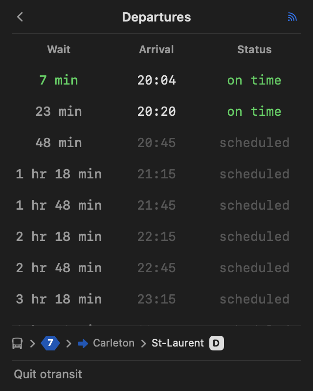
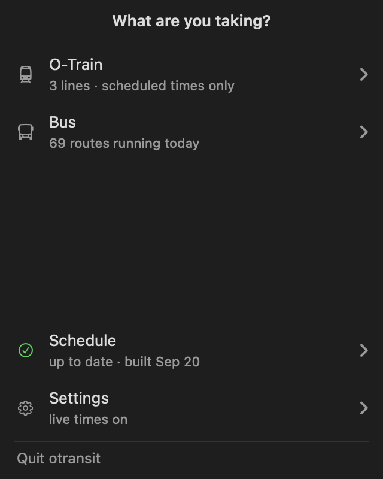

# otransit

Live OC Transpo departures in the macOS menu bar.

The colour is the interface. A wait under two minutes is red. Under six it is
amber, under fifteen it is green, and after that it is dim. The board answers
"do I need to leave now" before you read a number.

A command line version is available in
[Rust](https://github.com/sina-negarandeh/otransit-rust) and
[Go](https://github.com/sina-negarandeh/otransit-go).

## Why

I noticed that the last thing I usually do before closing my laptop is check
for transit updates to see if I should leave or squeeze in a few more minutes
of work. This always breaks my flow, forcing me to either open maps on my
laptop or pick up my phone. The menu bar is always there, so I thought this
would be a great opportunity to solve that pain point while improving my skills
in Swift, SwiftUI, and GTFS. Also, this was fun!

## Using it

Click the icon in the menu bar. Choose bus or O-Train, then a route, a
direction, and a stop. The board shows when each vehicle arrives.

Times are live where the feed knows the trip. A late bus keeps its scheduled
time, struck through, with the real time beside it. Rows after the end of the
live feed read `scheduled`.

The first screen ends with two rows about the program rather than about a
journey. Schedule says whether the timetable is current. Settings holds the
subscription key.

## The timetable

OC Transpo republishes the timetable every few days, and a prediction only
matches the export that issued it.

## Live times

Scheduled times need no key. Live predictions need a free subscription key from
the [developer portal](https://nextrip-public-api.developer.azure-api.net).
Open Settings and paste it.

Without a key, every time on screen is a scheduled one. That is a working
program, and the app says so rather than leaving you to work it out.

## Building it

You need macOS 27 and Xcode 27.

| | |
|---|---|
| `make app` | build the bundle at `.build/otransit.app` |
| `make run` | build the bundle and start it |
| `make check` | the gate: the formatter, the build, and the tests |
| `make shots` | draw every screen to a PNG |

Move the bundle to `/Applications` to keep it, because `make clean` deletes
`.build`.

## Reading it

The program is a model with a shell over it. `OTransitKit` answers what the
timetable says and decides what each screen holds. `OTransit` draws it in the
menu bar. The tests reach the kit alone, which is what keeps them free of a
window.

| | |
|---|---|
| `SQLite` · `CSV` · `Zip` | the three readers, and no transit in any of them |
| `Cache` · `Schema` · `Clock` | every query, against a SQLite cache of the feed |
| `Feed` · `Ingest` | the download and the ingest that build that cache |
| `Realtime` · `Poller` · `Cadence` | the live feed, and when to ask for it again |
| `Board` · `Freshness` · `Key` | the merge, the staleness, and the key |
| `Screen` · `Place` · `Trail` | the name of each screen, and the path that reached it |

There are no dependencies. SQLite comes from the SDK, SwiftUI draws the menu
bar, and Foundation does the rest.

One directory in Application Support holds everything: the SQLite cache of the
timetable, and the subscription key. The app reads nothing that another program
wrote, and writes nothing that another program reads. To uninstall, delete the
bundle and that directory.

## Limits

The realtime feed covers buses. Every O-Train time is a scheduled one.

## Attribution

Contains information licensed under the Open Government Licence - City of
Ottawa. https://open.ottawa.ca/pages/open-data-licence

Not affiliated with, endorsed by, or sponsored by OC Transpo or the City of
Ottawa.
